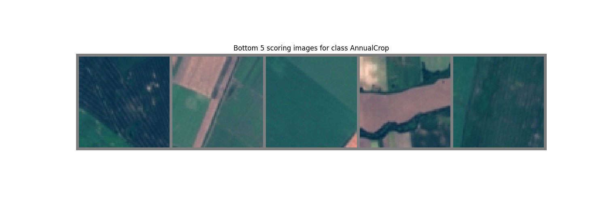
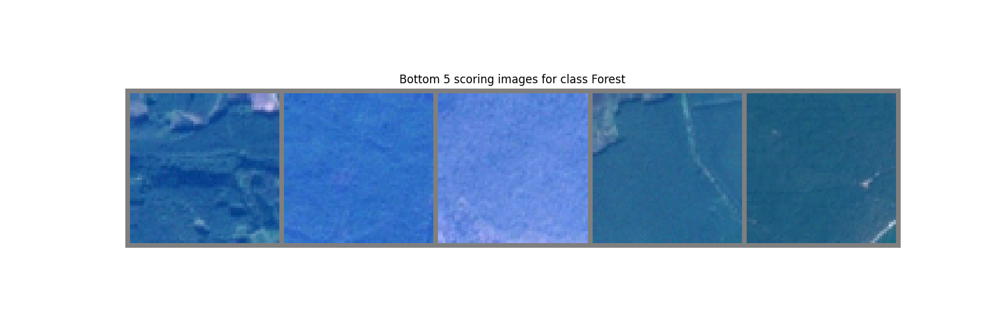
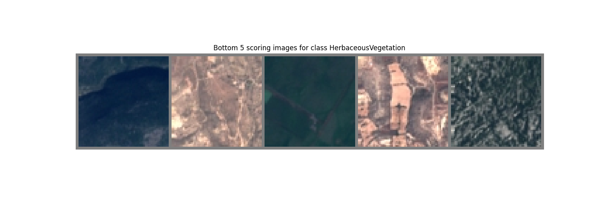

## Project Description

This project focuses on using Deep Learning techniques for classification tasks involving RGB and multispectral images from the EuroSAT dataset. The tasks include splitting the dataset, training models, and evaluating their performance. The project comprises three primary tasks:

1. **Train-Test Split**
2. **RGB Image Classification**
3. **Multispectral Image Classification**

---

## Folder Structure

- **`scripts/`**: Contains the training and testing logic.
- **`models/`**: Contains the model definitions and logic for loading pre-trained models.
- **`utils/`**: Includes utility functions, the custom dataset class, and the train-test split logic.

---

## Tasks Overview

### 1. Train-Test Split (Task 1)

Splits the dataset into training, validation, and testing sets.

- **Command**:
  ```bash
  python utils/train_test_split.py --root_dir <dataset_root>
  ```
- **Example**:
  ```bash
  python utils/train_test_split.py --root_dir D:\EuroSAT_RGB
  ```

---

### 2. RGB Image Classification (Task 2)

Trains and evaluates the model on RGB images.

- **Steps**:

  1. Ensure the dataset split contains RGB images (verify the `splits` folder under the project root directory).
  2. Run the `test_rgb.py` file to evaluate the model.

- **Command**:

  ```bash
  python scripts/test_rgb.py --root_dir <dataset_root> --save_logits <True|False>
  ```

  - Set `--save_logits True` to save newly computed logits.
  - Set `--save_logits False` to compare with pre-existing logits.

- **Example**:
  ```bash
  python scripts/test_rgb.py --root_dir D:\EuroSAT_RGB --save_logits False
  ```

---

### 3. Multispectral Image Classification (Task 3)

Trains and evaluates the model on multispectral images.

- **Steps**:

  1. Ensure the dataset split contains multispectral images.
  2. If the split contains RGB images, re-run the train-test split process for multispectral images.
  3. Run the `test_ms.py` file to evaluate the model.

- **Command**:
  ```bash
  python scripts/test_ms.py --root_dir <dataset_root> --save_logits <True|False>
  ```
- **Example**:
  ```bash
  python scripts/test_ms.py --root_dir D:\EuroSAT_MS --save_logits True
  ```

---

## Outputs and Plots

- Task 2: Accuracy and TPR per class for RGB images.

### Validation Accuracy Plot


### TPR Plot


- Task 3: Accuracy and TPR per class for multispectral images.

### Validation Accuracy Plot


### TPR Plot


- **Top and Bottom 5 Images**:
  - For the classes **AnnualCrop**, **Forest**, and **Herbaceous Vegetation**.
    
    
    
    
    
    

---

## Notes

- When providing the dataset root path, specify only the main directory (e.g., `D:\EuroSAT_RGB`), not the full path to the images.
- Ensure that the `splits` folder is correctly generated before proceeding with training or testing.

---

## Dependencies

- Python 3.x
- Required Python Libraries: Refer to `requirements.txt` or install:
  ```bash
  pip install -r requirements.txt
  ```

---

## How to Run

1. Set the dataset root path.
2. Perform the train-test split.
3. Train and test models for RGB and multispectral images.
4. Visualize and analyze the results.

---
